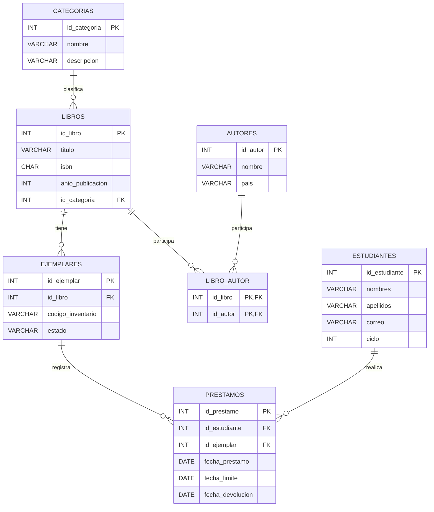

# Modelo entidad-relación

```mermaid
erDiagram
 CATEGORIAS ||--o{ LIBROS : clasifica
 LIBROS ||--o{ EJEMPLARES : tiene
 LIBROS ||--o{ LIBRO_AUTOR : participa
 AUTORES ||--o{ LIBRO_AUTOR : participa
 ESTUDIANTES ||--o{ PRESTAMOS : realiza
 EJEMPLARES ||--o{ PRESTAMOS : registra
 CATEGORIAS {
  INT id_categoria PK
  VARCHAR nombre
  VARCHAR descripcion
 }
 AUTORES {
  INT id_autor PK
  VARCHAR nombre
  VARCHAR pais
 }
 ESTUDIANTES {
  INT id_estudiante PK
  VARCHAR nombres
  VARCHAR apellidos
  VARCHAR correo
  INT ciclo
 }
 LIBROS {
  INT id_libro PK
  VARCHAR titulo
  CHAR isbn
  INT anio_publicacion
  INT id_categoria FK
 }
 LIBRO_AUTOR {
  INT id_libro PK,FK
  INT id_autor PK,FK
 }
 EJEMPLARES {
  INT id_ejemplar PK
  INT id_libro FK
  VARCHAR codigo_inventario
  VARCHAR estado
 }
 PRESTAMOS {
  INT id_prestamo PK
  INT id_estudiante FK
  INT id_ejemplar FK
  DATE fecha_prestamo
  DATE fecha_limite
  DATE fecha_devolucion
 }
```
